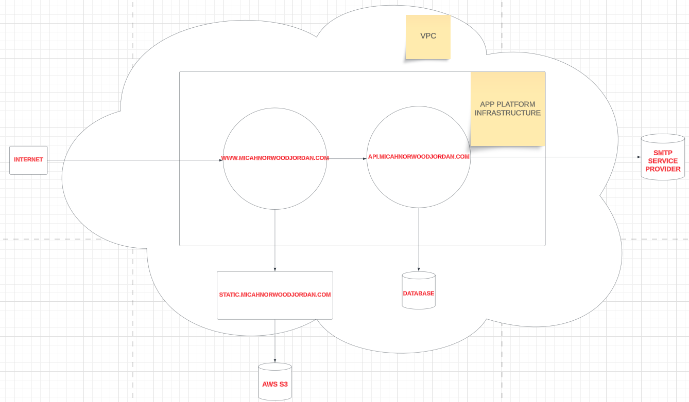

# context 📝

- this is a fairly simple site meant to showcase a few of my professional competencies, and also shed a light on the man behind the engineer 😀

## objective ✍️

- My primary objective was to simply get the site up and running ✅, but I tempered this need for speed with the following secondary goals:
  - deploy the site through a CI/CD pipeline, using any CI/CD tools I haven't used before ✅
  - build the backend (the `Contact Me` functionality) using a relevant web framework that I haven't used before ✅
  - slow down my development to truly understand the fundamentals, nitty gritty details, and "gotchas" of all the tools used from beginning to end ✅

## infrastructure

- site diagram: 

## tech stack 🥞

### frontend 👨‍💻

- `www.micahnorwoodjordan.com`
- TypeScript using the Angular framework 🏎️💨
  - <i>**WHY**:</i> Since I'm already pretty familiar with Angular, I decided to use it to help my development speed, since building the backend and configuring the deployment strategy were inevitably going to be a speed bottleneck
- Obviously, this runs client side, and serves as a window into who I am as a person and software engineer 😃

### backend 📟

- `api.micahnorwoodjordan.com`
- Java using Spring Boot 🍃
  - <i>**WHY**:</i> It's been about 5 years since I've written code in Java that saw any sunlight. On top of that, I only ever wrote vanilla Java; I never actually used frameworks, so getting some exposure and familiarity was a must.
- this runs server side and is only responsible for taking email message payloads from the frontend and writing them to a subsequent SMTP service call to allow curious site visitors to contact me via email

### cdn 📦

- `static.micahnorwoodjordan.com`
- Admittedly, CDN is sort of a misnomer here, as the "network" portion of the acronym is comprised of only a single node, `static.micahnorwoodjordan.com`, which is an Ubuntu droplet that I manually deployed and configured to serve static images and fonts via Nginx. It's more of a Content Delivery Instance 🤫
- I thought about committing some of the deployment scripts and configuration files to the codebase since I'm a fan of IaC, but I just haven't yet for some reason.
- I had a lot of fun figuring out how to get this Content Delivery Instance to serve one of my favorite fonts, `DinaRemaster`

### deployment strategy 🚀

- DigitalOcean's App Platform 🌊
  - <i>**WHY**:</i> I'm very accustomed to building on, deploying, and configuring DigitalOcean architecture, but only as standalone parts of a system that I have to tether together by managing IP addresses, firewalls, load balancing, and DNS, while also building custom SSL certificate renewal scripts. App Platform handles most of this overhaul.
  - It was a bumpy ride navigating the undocumented "gotchas" of App Plaform, but I found that it has a fairly simple pre-deployment build test and a lovely DNS management system ☝️🤓

### dns 🌎

- I would've normally purchased my domain from Google, but sadly domains managed by Google have all been migrated to Squarespace, so I already reluctantly have some skin in the game with Squarespace.
- I pointed the `micahnorwoodjordan.com` domain and subdomains at the IP addresses of the App Platform apps, and configured each app to point to the `micahnorwoodjordan.com` domain.

### potentially tragic pitfalls of my DNS management strategy 🚨

- non-static IP addresses
  - App Platform Apps are each deployed to their own Droplets whose IP addresses are NOT static (not sure how , but I guess in the grand scheme of things, we're all just sharing the same network space, so I won't think too hard about it). Even coughing up more cash to configure static IP addresses for your apps won't allow you to route traffic based on IP (we have to accept "just because" as an answer because DigitalOcean's docs don't explain why), so whenever the IP addresses for my Apps rotate, I have to manually find the new IP addresses using a DNS lookup and update all DNS configs from the front of my system to the back.
  - Since I don't know what causes IP addresses to flip, nor how often, I'm basically waiting for my site to go down until I update all DNS configurations.

## design philosophy 🧐

- Building this website was a tough battle in terms of pulling back on my desire to build because of my desire to learn, so nowhere in this system do I attempt to do anything fancy or revolutioinary. As such:
  - the backend follows the classic MVC architectural pattern as a virtue of Spring
  - the frontend is component-based as a virtue of Angular.
  - the CDN simply serves static resources

## developer gripes 🤬

### App Platform

#### non static IP addresses ❌

- 🤦🏽‍♂️ harking back to the non-static nature of IP addresses native to Droplets deployed via App Platform, I wanted to deploy a firewall around the API and CDN, but:
  - it would be another manual labor task to update the IP-based ingress and egress rules within the App Spec yaml whenever my apps' IP addresses rotate
  - due to the above, I'm considering delegating all preliminary security measures for `api.micahnorwoodjordan.com` to Spring Boot itself, which is very non-standard
  - configuring the Ubuntu firewall (UFW) on `static.micahnorwoodjordan.com` would also be another manual labor task, since `ufw` does not support domain-based rule configurations top the best of my knowledge
